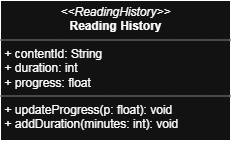

# Transparent Books&Art Viewer

A Java-based application for Window users to view book & art in a beautiful way.

## Images
## Main features
Class Diagram:
-History

](url)

Lịch sử đọc (Reading History): Theo dõi và ghi lại hoạt động của người dùng với nội dung, thời lượng xem/đọc, và tiến độ đọc hiện tại đối với truyện dài. Tính năng này giúp người dùng dễ dàng tiếp tục từ vị trí đã dừng và xem lại những nội dung đã tương tác.
Phân tích:
- Nội dung truyện: contentID
- Thời lượng xem/đọc: duration
- Cập nhật thời lượng xem/đọc: addDuration()
- Tiến độ đọc: progress
- Cập nhập tiến độ đọc: updateProgress()
-Comment:

Comment (Bình luận): Hệ thống bình luận cho phép người dùng thêm, xóa ghi chú cá nhân, suy nghĩ, hoặc đánh giá về từng nội dung.
-User:

## Technology Used
## Installation
## About
