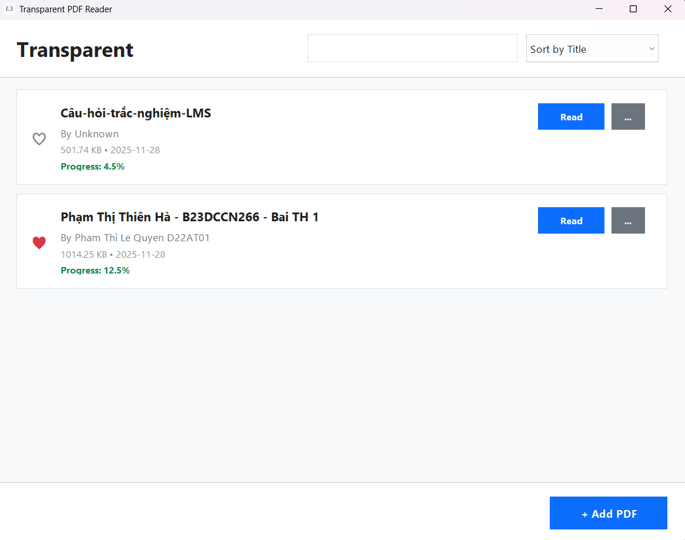
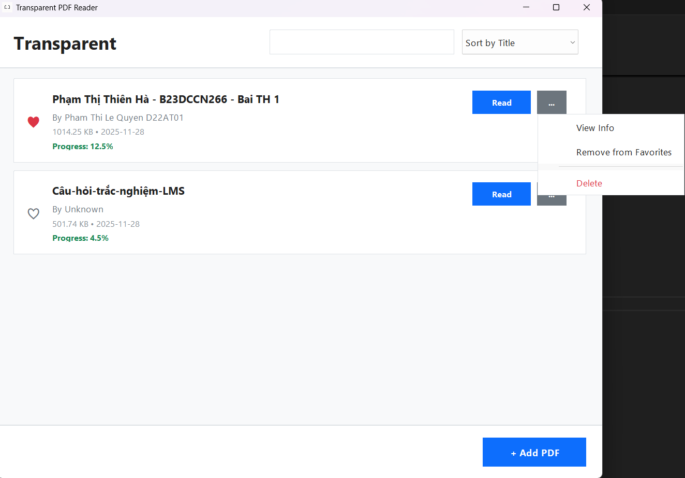
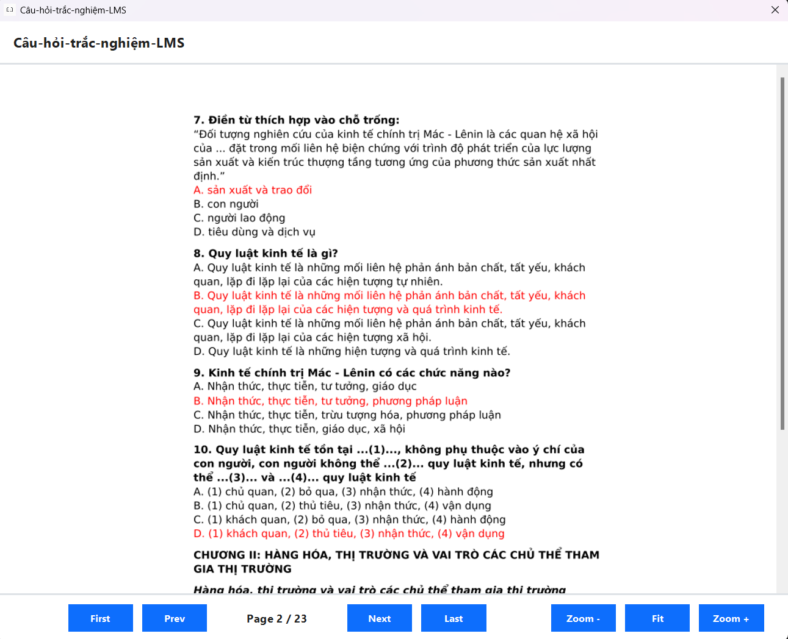

# 📄 Transparent PDF Reader 

<div align="left">


**A modern, elegant PDF management and reading application for Windows**

[](https://www.oracle.com/java/technologies/javase-downloads.html)
[](https://pdfbox.apache.org/)
[](LICENSE)

</div>

---

## 📖 Table of Contents

- [About](#about)
- [Features](#features)
- [Screenshots](#screenshots)
- [Requirements](#requirements)
- [Installation](#installation)
- [Usage Guide](#usage-guide)
  - [Adding PDFs](#adding-pdfs)
  - [Reading PDFs](#reading-pdfs)
  - [Managing Library](#managing-library)
  - [Search & Filter](#search--filter)
- [Keyboard Shortcuts](#keyboard-shortcuts)
- [Data Storage](#data-storage)
- [Troubleshooting](#troubleshooting)
- [Technical Details](#technical-details)
- [Contributing](#contributing)
- [License](#license)

---

## 🎯 About

**Transparent PDF Reader** is a lightweight yet powerful PDF management application designed with a modern, clean interface. Built with Java Swing and Apache PDFBox, it provides a seamless experience for organizing, reading, and tracking your PDF documents.

### Why Transparent?

- 🎨 **Modern Design**: Clean, professional UI with Windows-optimized rendering
- 📚 **Smart Organization**: Favorite system, reading progress tracking, and intelligent sorting
- ⚡ **High Performance**: Optimized PDF rendering with DPI scaling support
- 💾 **Auto-Save**: Automatic progress tracking and data persistence
- 🔍 **Quick Search**: Instant search by title or author

---

## ✨ Features

### 📚 Library Management
- **Import PDFs** with automatic metadata extraction
- **Organize** with favorites system (❤️)
- **Track reading progress** automatically
- **Search** by title or author in real-time
- **Sort** by title, author, or favorites

### 📖 PDF Viewer
- **High-quality rendering** with DPI scaling support (100%, 125%, 150%, 200%)
- **Zoom controls** (50% - 300%)
- **Page navigation** with keyboard shortcuts
- **Jump to page** functionality
- **Progress auto-save** on every page turn

### 🎨 User Interface
- Modern card-based layout
- Responsive design
- Windows-optimized anti-aliasing
- Clear visual feedback for all actions
- Intuitive menu system

---

## 📸 Screenshots

### Main Library View



### PDF Viewer



---

## 💻 Requirements

### System Requirements
- **Operating System**: Windows 7/8/10/11
- **Java Runtime**: JRE 8 or higher
- **Memory**: Minimum 512 MB RAM (1 GB recommended)
- **Storage**: 50 MB for application + space for PDF files

### Dependencies
- Apache PDFBox 2.0+
- Java Swing (built-in)

---

## 🚀 Installation

###  Run JAR File

1. **Install Java** if not already installed:
   ```bash
   # Check Java version
   java -version
   ```
   Download from: [Oracle Java Downloads](https://www.oracle.com/java/technologies/javase-downloads.html)

2. **Download** the latest release:
   - Download jar file from [Releases](https://github.com/Transparent-web-team/Transparent-Book-Art-Viewer/releases)

3. **Run** the application:
   - Click the jar file to open the application.


---

## 📘 Usage Guide

### Adding PDFs

1. Click **"+ Add PDF"** button at the bottom right
2. Click **"Browse"** to select a PDF file
3. **Title** and **Author** are auto-extracted (editable)
4. Click **"Add"** to add to your library

**Auto-Extraction Features:**
- Title extracted from filename
- Author extracted from PDF metadata
- File size calculated automatically
- Date added recorded

### Reading PDFs

1. Find your PDF in the library
2. Click **"Read"** button on the card
3. PDF opens in a new viewer window

**Viewer Controls:**
- **Navigation**: Use buttons or keyboard shortcuts
- **Zoom**: Adjust from 50% to 300%
- **Jump to Page**: Click on page number "Page X / Y"
- **Progress**: Automatically saved on every page turn

### Managing Library

#### Favorites ❤️
- Click the **heart icon** to toggle favorite status
- Sort by favorites to see them first
- Favorites persist between sessions

#### View Information
1. Click **"..."** menu on any PDF card
2. Select **"View Info"**
3. See all metadata: ID, title, author, size, format, date, path, progress

#### Delete PDFs
1. Click **"..."** menu
2. Select **"Delete"**
3. Confirm deletion

**Note:** Deleting removes the entry from library, not the actual file.

### Search & Filter

#### Search
- Type in search box (top right)
- Searches **both title and author**
- Results update in real-time
- Press Enter or just type

#### Sort Options
1. **Sort by Title**: Alphabetical A-Z
2. **Sort by Author**: Alphabetical by author name
3. **Sort by Favourite**: Favorites first, then by title

---

## ⌨️ Keyboard Shortcuts

### In PDF Viewer

| Shortcut           | Action                         |
|----------          |--------                        |
| `→` or `Page Down` | Next page                      |
| `←` or `Page Up`   | Previous page                  |
| `Home`             | First page                     |
| `End`              | Last page                      |
| `Ctrl + G`         | Jump to page                   |
| `Esc`              | Close dialog (in jump-to-page) |

### Tips
- Click on **"Page X / Y"** text for quick page jump
- Use **Zoom buttons** for better readability
- Press **"Fit"** to reset zoom to 100%

---

## 💾 Data Storage

The application stores data in the same directory as the JAR file:

```
transparent-pdf-reader/
├── transparent-pdf-reader.jar
├── contents.dat           # PDF library data
├── favorites.dat          # Favorite PDFs
├── progress.dat           # Reading progress
└── nextid.dat            # ID counter
```

### Data Persistence
- **Automatic saving** after every change
- **Reading progress** saved on page turn
- **Favorites** persist between sessions
- **No manual save needed**

### Backup Your Data
Simply copy the `.dat` files to backup your library:
```bash
# Backup
cp *.dat backup/

# Restore
cp backup/*.dat .
```

---

## 🔧 Troubleshooting

### PDF Won't Open
**Problem:** "File not found" error

**Solution:**
- Ensure PDF file hasn't been moved or deleted
- Check file path in "View Info"
- Re-add the PDF if necessary

### Blurry PDF Rendering
**Problem:** Text appears blurry on high-DPI displays

**Solution:**
- The app auto-detects Windows DPI scaling (100%, 125%, 150%, 200%)
- Try adjusting zoom level
- Ensure you're running latest Java version

### Application Won't Start
**Problem:** Double-clicking JAR does nothing

**Solution:**
```bash
# Run from command line to see errors
java -jar transparent-pdf-reader.jar

# Check Java version
java -version  # Should be 8 or higher
```

### Slow PDF Loading
**Problem:** Large PDFs take time to load

**Solution:**
- This is normal for large files (50+ MB)
- Initial page rendering takes longer
- Subsequent pages load faster
- Consider using smaller PDF files

### Lost Progress
**Problem:** Reading progress disappeared

**Solution:**
- Check if `.dat` files exist in application directory
- Progress saves on page turn, not on close
- Turn at least one page before closing viewer

---

## 🔍 Technical Details

### Architecture
```
┌─────────────────────────────────────────┐
│              GUI Layer                  │
│  (GUI.java, PDFViewer.java)             │
├─────────────────────────────────────────┤
│         Business Logic Layer            │
│      (ContentManager.java)              │
├─────────────────────────────────────────┤
│           Data Layer                    │
│  (Content, Info, ReadingHistory)        │
├─────────────────────────────────────────┤
│         Persistence Layer               │
│   (Serialization to .dat files)         │
└─────────────────────────────────────────┘
```

### Key Components

**GUI.java**
- Main application window
- Library management interface
- Search and sort functionality
- Modern card-based layout

**PDFViewer.java**
- PDF rendering engine
- Page navigation
- Zoom controls
- DPI scaling support
- Progress tracking

**ContentManager.java**
- CRUD operations for PDFs
- Search functionality
- Sorting algorithms
- Data persistence
- Progress management

**Content.java**
- PDF metadata model
- Serializable for persistence

**Info.java**
- File information (size, format, date)
- Size formatting helper

**ReadingHistory.java**
- Reading progress tracking
- Progress validation (0-100%)

### PDF Rendering Details
- **Library**: Apache PDFBox 2.0+
- **DPI Scaling**: Auto-detects Windows scaling (96 DPI baseline)
- **Effective DPI**: `96 × System Scale × Zoom Level`
- **Image Type**: RGB for better quality on Windows
- **Anti-aliasing**: Bicubic interpolation for smooth rendering
- **Caching**: Pages rendered on-demand

---

## 🤝 Contributing

We welcome contributions! Here's how you can help:

### Reporting Bugs
1. Check if the issue already exists
2. Create a new issue with:
   - Clear description
   - Steps to reproduce
   - Expected vs actual behavior
   - System info (OS, Java version)

### Suggesting Features
- Open an issue with `[Feature Request]` prefix
- Describe the feature and use case
- Explain how it benefits users

### Pull Requests
1. Fork the repository
2. Create a feature branch: `git checkout -b feature-name`
3. Make your changes
4. Test thoroughly
5. Commit: `git commit -m "Add feature"`
6. Push: `git push origin feature-name`
7. Open a Pull Request

### Code Style
- Use Java naming conventions
- Comment complex logic
- Keep methods focused and small
- Follow existing code structure

---

## 📄 License

This project is licensed under the MIT License - see the [LICENSE](LICENSE) file for details.

```
MIT License

Copyright (c) 2024 [Your Name]

Permission is hereby granted, free of charge, to any person obtaining a copy
of this software and associated documentation files...
```

---

## 🙏 Acknowledgments

- **Apache PDFBox** - PDF rendering engine
- **Oracle Java** - Application platform
- **Modern UI Inspiration** - Based on contemporary design trends

---

## 📧 Contact & Support

- **Issues**: [GitHub Issues](https://github.com/Transparent-web-team/Transparent-Book-Art-Viewer/issues)

---

<div align="left">

**Made with ❤️ by Transparent Web Team**

⭐ Star this repo if you find it helpful!